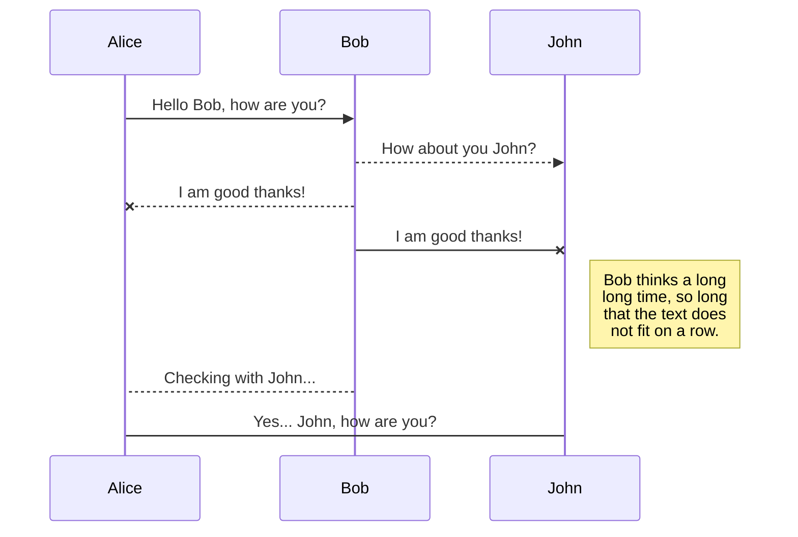
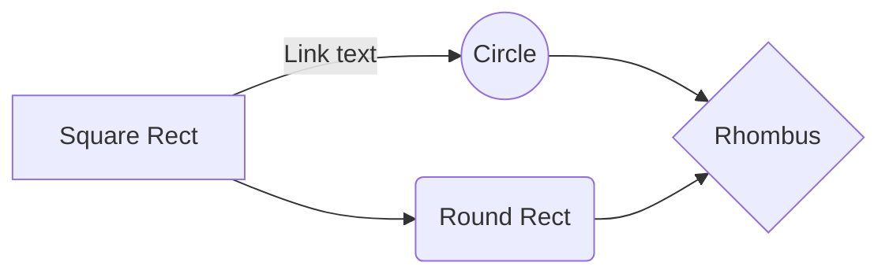

## Consulta Plano Orçamentário App

Em construção...

### Tabela de conteúdo do readme
- [Publicações](#publicações)
	 - [Google Play](#google-play)
- [Instalação inicial](#instalação-inicial)
  - [Node Version Manager (NVM)](#node-version-manager-nvm)
  - [Ionic Client](#ionic-client)
  - [Cordova](#cordova)
    - [Android Version](#cordova-android-version)
  - [Build for Android](#build-for-android)
  - [Fontes](#fontes)

### Publicações
#### Google Play
- App: Autoestudo Plano Orçamentário
	- Disponível em: https://play.google.com/store/apps/details?id=br.com.waldeckmatheus.cpo

### Instalação inicial
#### Node version manager (NVM)
    $ curl -o- https://raw.githubusercontent.com/nvm-sh/nvm/v0.39.1/install.sh | bash
    $ nvm install 18.5.0
      - necessário: glibc >= 2.28 para a versão 18 do node
    
#### Ionic client
    $ npm install -g @ionic/cli

#### Cordova
    $ npm i -g cordova
    $ ionic integrations disable capacitor

###### Cordova Android Version
    $ ionic cordova platform rm android
    $ cordova platform add android@10.1.2

###### Cordova Telemetria
    $ cordova telemetry [on|off]

#### Build for android
    $ ionic cordova build android --prod --release --verbose

#### Resumo do build em container
- https://github.com/waldeckmatheus/consulta-plano-orcamentario-web/blob/main/scriptBuildIntoContainer.sh

#### Criação do arquivo de assinatura para realização de assinatura do APK utilizado em testes locais
    $ keytool -genkey -v -keystore mykeystore.keystore -alias myandroidalias -keyalg RSA -keysize 2048 -validity 10000

#### Geração do arquivo output.zip para assinatura do arquivo .aab a ser realizado no Google Play Console 
    $ java -jar pepk.jar --keystore=mykeystore.keystore --alias=myandroidalias --output=output.zip --include-cert --encryptionkey=eb10fe8f7c7c9df715022017b00c6471f8ba8170b13049a11e6c09ffe3056a104a3bbe4ac5a955f4ba4fe93fc8cef27558a3eb9d2a529a2092761fb833b656cd48b9de6a

- Utilização de pepk (Play Encrypt Private Key)
- Utilização da Google Play Store Public Key= "valor atribuído na encryptionkey"
   
#### Assinatura do arquivos .aab e/ou .apk
    $ jarsigner -verbose -sigalg SHA1withRSA -digestalg SHA1 -keystore mykeystore.keystore app-release.aab myandroidalias
    $ jarsigner -verbose -sigalg SHA1withRSA -digestalg SHA1 -keystore mykeystore.keystore app-release-unsigned.apk myandroidalias

### Fontes
| Nome  | URL |
|--|--|
| NVM  | https://github.com/nvm-sh/nvm |
| Angular | https://angular.io/docs |
| Ionic/Cli | https://ionicframework.com/docs/intro/cli |
| Ionic Components | https://ionicframework.com/docs/components |
| Capacitor Build | https://ionicframework.com/docs/cli/commands/capacitor-build |
| Ionic Android | https://ionicframework.com/docs/developing/android |
| Apache Cordova | https://cordova.apache.org/docs/en/11.x/guide/overview/index.html |
| Cordova Android | https://github.com/apache/cordova-android/releases |
| Docker Android | https://hub.docker.com/r/androidsdk/android-31 |
| Docker Compose | https://docs.docker.com/compose/ |
| Gradle | https://gradle.org/install/ |

## UML diagrams

You can render UML diagrams using [Mermaid](https://mermaidjs.github.io/). For example, this will produce a sequence diagram:

And this will produce a flow chart:

